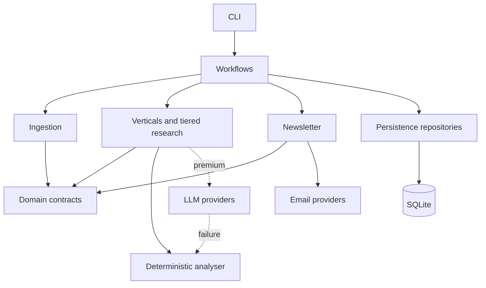
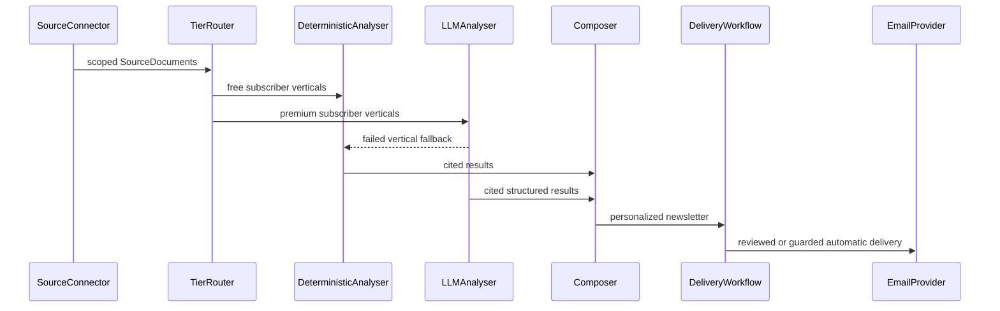
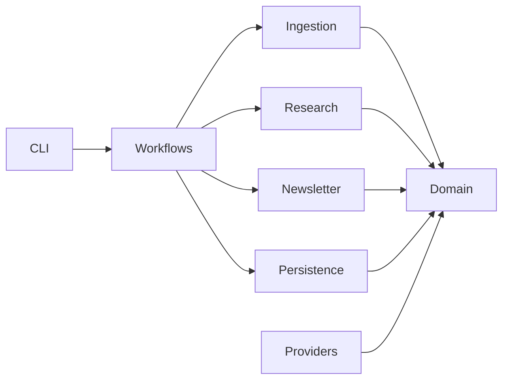
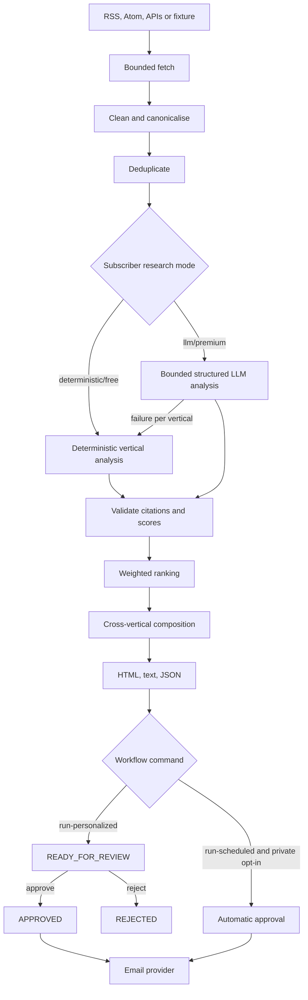
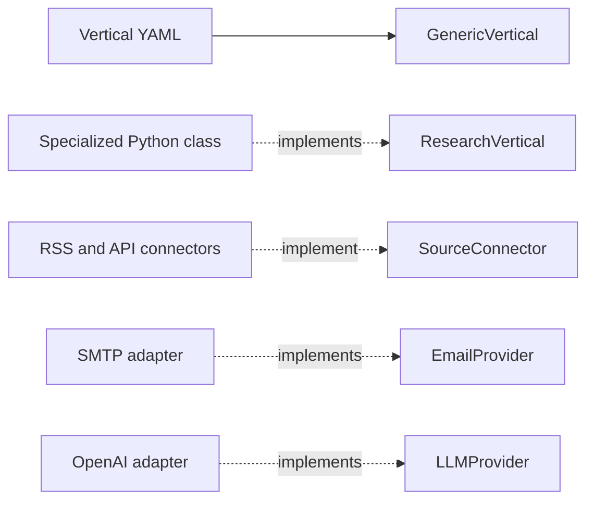

# Architecture

## Philosophy

Vortenix Newsletter is a modular monolith: one deployable Python application with explicit internal boundaries. This keeps local operation, transactions, debugging, and contribution approachable while allowing mature verticals or providers to be extracted later. Extraction is an option earned by independent scaling or ownership needs, not a prerequisite.

The domain package owns vocabulary and invariants. Application workflows coordinate use cases. Adapters translate external RSS/Atom and structured APIs, email, LLM, filesystem, and database concerns. Domain models do not import SQLAlchemy or provider SDKs.

## Core contract

## Boundaries and responsibilities

| Package | Responsibility | Depends primarily on |
| --- | --- | --- |
| `domain` | Models, enums, transitions, application exceptions | Pydantic, standard library |
| `config` | YAML parsing and validation | Domain, Pydantic, PyYAML |
| `ingestion` | RSS/Atom and API collection, cleaning, provenance, canonicalisation, deduplication | Domain, HTTP/parser adapters |
| `verticals` | Research plans and vertical implementations | Domain, config, ranking |
| `research` | Explainable ranking and evidence validation | Domain, config |
| `newsletter` | Selection, composition, rendering, approval/delivery service | Domain, templates, provider contract |
| `persistence` | SQLAlchemy records and repositories | Domain, SQLAlchemy |
| `providers` | Console/SMTP and deterministic/OpenAI adapters | Domain and optional SDKs |
| `workflows` | End-to-end application orchestration and fault isolation | Application packages |
| `cli` | User input/output and process entry point | Workflows and services |

## Dependency direction

Provider and repository implementations are replaceable edges. The current code has concrete repository classes rather than formal repository protocols; introducing protocols should happen when a second persistence implementation makes the contract concrete.

## Workflow and failure model

Individual source and vertical failures are logged and treated as recoverable so remaining work can continue. Invalid configuration, persistence setup failures, and invalid state transitions are fatal to the invoked command. See [error handling](docs/development/error-handling.md).

## Extension points

Today the vertical registry constructs generic implementations from YAML. Personalized workflows group subscribers by `research_mode`: free subscribers use deterministic analysis and premium subscribers use evidence-constrained OpenAI Structured Outputs. Premium failure falls back per vertical and is recorded in newsletter metadata. Interactive commands preserve review; unattended SMTP delivery requires a separate private opt-in and isolates subscriber failures.

## Future extraction

A module may become an independent service when it has a separate owner, deployment cadence, security boundary, or scaling profile. The extraction path is to preserve domain DTOs and provider protocols at the boundary, introduce a transport adapter, and move persistence ownership deliberately. Shared-database microservices and premature queues are explicitly avoided.

See [DECISIONS.md](DECISIONS.md) and the detailed [ADRs](docs/adr/).
