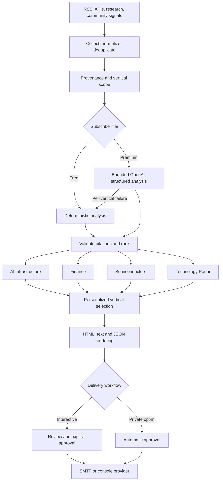
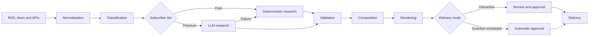
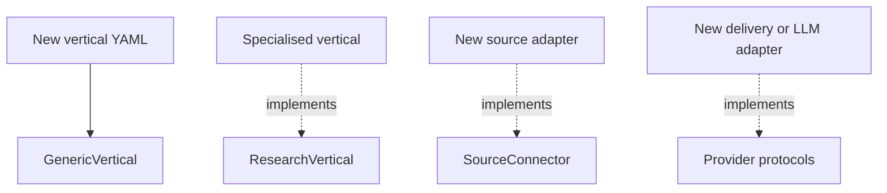
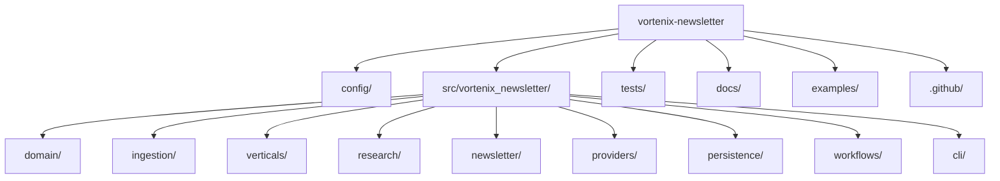

<div align="center">
  
  <p><strong>An extensible, evidence-first research newsletter pipeline.</strong></p>

[](https://www.python.org/)
[](https://github.com/vortenix/vortenix-newsletter/actions/workflows/ci.yml)
[](LICENSE)
[](https://docs.astral.sh/ruff/)
[](https://mypy-lang.org/)
[](tests/)

</div>

Vortenix Newsletter collects diverse source material, builds personalized cited briefings across independent research verticals, and delivers them through either a review-first workflow or an explicitly enabled unattended schedule. Free subscribers receive deterministic research; premium subscribers receive evidence-constrained LLM analysis with transparent per-vertical deterministic fallback.

> [!IMPORTANT]
> This project is alpha software. Console delivery remains the safe default. SMTP, structured OpenAI analysis, and unattended delivery are separate explicit opt-ins. The scheduled command requires `VORTENIX_ALLOW_AUTOMATIC_SEND=true`; interactive generation retains the approval gate.

## Why Vortenix?

Research newsletters combine unreliable networks, untrusted source text, topic-specific judgement, subscriber preferences, AI-provider failures, editorial review, and external delivery. Vortenix separates those concerns behind typed contracts. Every selected finding retains its source citation and application-owned scores; premium AI failure changes the analysis path, not whether a subscriber receives an edition.

## Features

- RSS/Atom, Hacker News, Crossref, GDELT, FRED, and credentialed Reddit connectors with bounded I/O, provenance, vertical scoping, and deduplication.
- Four initial verticals: AI Infrastructure, Finance, Semiconductors, and Technology Radar.
- YAML-driven generic verticals with validated ranking weights.
- Private subscriber profiles with independent vertical selections and newsletters.
- Offline deterministic analysis with extractive summaries, pain-point and company heuristics, citations, and reproducible scores.
- Free deterministic and premium evidence-constrained OpenAI research tiers, with per-vertical deterministic fallback.
- HTML, plain-text, and JSON rendering with escaped source content.
- SQLite/SQLAlchemy persistence separated from Pydantic domain models.
- Review-first `READY_FOR_REVIEW -> APPROVED -> SENT` workflow plus separately guarded automatic delivery.
- Console delivery for safe local development and opt-in SMTP configured through local secrets.
- Typer CLI, typed extension protocols, fixtures, tests, and CI.

## Architecture at a glance



The project is a modular monolith: a single Python application with domain, ingestion, research, newsletter, provider, and persistence boundaries. Read [ARCHITECTURE.md](ARCHITECTURE.md) for dependency rules, failure handling, and future service extraction.

## Screenshots

The project currently has no web interface. Newsletter output is email-compatible HTML; a representative preview is generated by the quick start below. Curated screenshots will be added when visual fixtures and accessibility review are stable.

## Installation

Requires Python 3.12 or newer.

### Windows PowerShell

```powershell
git clone https://github.com/vortenix/vortenix-newsletter.git
Set-Location vortenix-newsletter
py -3.12 -m venv .venv
.venv\Scripts\Activate.ps1
python -m pip install -e ".[dev]"
Copy-Item .env.example .env
```

### Unix shells

```bash
git clone https://github.com/vortenix/vortenix-newsletter.git
cd vortenix-newsletter
python3.12 -m venv .venv
source .venv/bin/activate
python -m pip install -e '.[dev]'
cp .env.example .env
```

## Quick start

Run the complete workflow without internet access, API keys, or SMTP credentials:

```console
vortenix config validate
vortenix db init
vortenix workflow run-daily --demo
```

If the installed script is not on `PATH`, replace `vortenix` with `python -m vortenix_newsletter.cli.app`. The command prints a newsletter ID and creates:

```text
data/newsletters/<newsletter-id>/newsletter.html
data/newsletters/<newsletter-id>/newsletter.txt
data/newsletters/<newsletter-id>/newsletter.json
```

Inspect and explicitly approve it:

```console
vortenix newsletter show <newsletter-id>
vortenix newsletter approve <newsletter-id>
vortenix newsletter send <newsletter-id>
```

By default, `send` uses `ConsoleEmailProvider`: it prints preview metadata and transmits nothing. Setting `VORTENIX_EMAIL_PROVIDER=smtp` in the local `.env` opts into real SMTP delivery. Rejected or unapproved newsletters cannot be sent.

## Workflow



Source and vertical failures are isolated where possible, allowing a partial cited briefing. Configuration and database failures stop the command. See the [workflow guide](docs/user-guide/workflow.md).

## Configuration

- `config/application.yaml` — database URL and confidence threshold.
- `config/sources.yaml` — source names, feed locations, and article-fetch settings.
- `config/audiences.yaml` — recipients, enabled verticals, and preference metadata.
- `config/subscribers.local.yaml` — private subscriber addresses and vertical selections; ignored by Git.
- `config/verticals/*.yaml` — keywords, research areas, weights, headings, and item limits.

Run `vortenix config validate` after edits. The [configuration reference](docs/user-guide/configuration.md) documents every accepted field, default, validation rule, and currently unused metadata field.

## Research modes

**Deterministic mode** powers free subscribers and requires no AI service. It matches configured keywords, extracts concise source sentences, applies simple entity/pain-point heuristics, retains citations, and calculates weighted scores outside any prompt.

**LLM mode** powers premium subscribers through the optional `OpenAIProvider` and Pydantic Structured Outputs. It sends only bounded, authorized, keyword-matched documents, requires supplied document IDs for citations, rejects invented citation IDs, calculates scores in application code, and falls back independently for each failed vertical. A premium edition records requested and actual analysis modes plus fallback warnings.

Enable it locally:

```console
python -m pip install -e ".[openai,dev]"
```

```dotenv
VORTENIX_RESEARCH_MODE=llm
OPENAI_API_KEY=your-project-api-key
OPENAI_MODEL=gpt-4.1-mini
VORTENIX_LLM_MAX_DOCUMENTS=20
VORTENIX_LLM_MAX_DOCUMENT_CHARS=6000
```

The key belongs only in the Git-ignored `.env`. API use may incur charges. See [LLM research mode](docs/user-guide/llm-research.md) before enabling it.

## Extending the project



To add a generic vertical, copy [`examples/minimal-vertical.yaml`](examples/minimal-vertical.yaml), choose a unique ID and weights totalling `1.0`, place it under `config/verticals/`, and enable it for an audience. A specialised vertical implements `ResearchVertical` and requires registry wiring. A connector implements asynchronous `SourceConnector.fetch`, returns normalised `SourceDocument` objects, and needs safe I/O limits and offline fixtures. See [extension development](docs/development/extensions.md).

## CLI

```text
vortenix config validate
vortenix db init
vortenix sources collect
vortenix research run [--vertical ID]
vortenix newsletter generate --audience ID
vortenix newsletter list
vortenix newsletter show ID
vortenix newsletter approve ID
vortenix newsletter reject ID
vortenix newsletter send ID [--force]
vortenix subscribers list [--audience ID]
vortenix workflow run-daily [--audience ID] [--demo]
vortenix workflow run-personalized [--audience ID] [--subscriber ID] [--demo]
vortenix workflow run-scheduled [--audience ID]
```

### Personalized subscriber newsletters

Copy `config/subscribers.example.yaml` to `config/subscribers.local.yaml` and give each subscriber an ID, private email address, research mode, and any subset of the audience's enabled verticals. Use `research_mode: deterministic` for the free tier or `research_mode: llm` for the premium tier. The local file is ignored by Git. Then generate separate review drafts:

```console
vortenix subscribers list --audience anish_daily
vortenix workflow run-personalized --audience anish_daily --demo
```

Sources are collected once. Required verticals are analysed once per active research tier, because deterministic and LLM results are intentionally independent. Composition creates one newsletter per subscriber containing only selected sections and records requested versus actual analysis. `run-personalized` stops at `READY_FOR_REVIEW`; the separately guarded `run-scheduled` command automatically approves and sends each subscriber independently.

See the [CLI reference](docs/reference/cli.md) for current semantics and limitations.

For explicitly opted-in, no-review delivery to all subscribers by approximately 8:00 AM, see the [scheduling guide](docs/user-guide/scheduling.md). GitHub Actions starts at 7:45 AM to avoid top-of-hour scheduler congestion; Windows Task Scheduler can run at 8:00 AM directly. Local secrets remain in the Git-ignored `.env`; cloud credentials and the private subscriber list belong in encrypted Actions secrets.

## Project layout



## Development and testing

```console
make format
make check
make coverage
make demo
```

The equivalent commands work directly on Windows where `make` is unavailable. Start with [the development guide](docs/development/setup.md) and read [CONTRIBUTING.md](CONTRIBUTING.md) before opening a pull request.

## Roadmap

Near-term work focuses on delivery idempotency, durable scheduling, ingestion observability, migrations, stronger corroboration, and SMTP delivery auditing. Later phases cover improved analysis, a review dashboard, publishing channels, knowledge modelling, and evidence-driven service extraction. See [ROADMAP.md](ROADMAP.md).

## Contributing

Bug reports, focused features, tests, documentation, and examples are welcome. Use the issue templates, keep changes cohesive, run `make check`, and include documentation for public behaviour or configuration. See [CONTRIBUTING.md](CONTRIBUTING.md) and the [Code of Conduct](CODE_OF_CONDUCT.md). Report vulnerabilities privately according to [SECURITY.md](SECURITY.md).

## License

Vortenix Newsletter is available under the [MIT License](LICENSE).

## Acknowledgements

Built with Pydantic, SQLAlchemy, Typer, Jinja2, HTTPX, feedparser, Beautiful Soup, PyYAML, Ruff, mypy, and pytest. The community code of conduct is adapted from Contributor Covenant 2.1, and changelog conventions follow Keep a Changelog.
