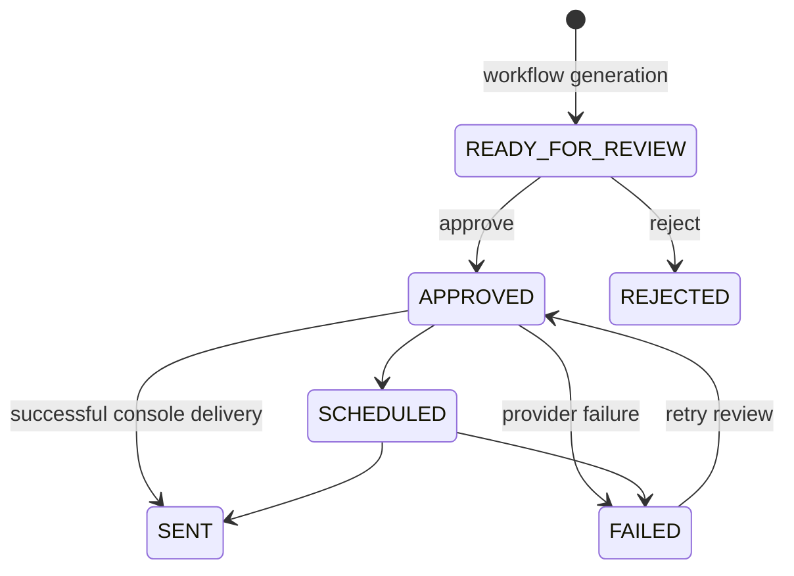

# Newsletter workflow

The offline quick start is:

```console
vortenix db init
vortenix workflow run-daily --demo
vortenix newsletter show NEWSLETTER_ID
vortenix newsletter approve NEWSLETTER_ID
vortenix newsletter send NEWSLETTER_ID
```



Interactive generation (`run-daily` and `run-personalized`) stops at `READY_FOR_REVIEW`. Sending without approval exits unsuccessfully. `--force` allows the current service to resend an already sent newsletter by resetting it to approved immediately before delivery; use it deliberately.

Personalized generation groups subscribers by research tier. Free subscribers (`research_mode: deterministic`) use reproducible local analysis. Premium subscribers (`research_mode: llm`) use bounded, evidence-constrained structured LLM analysis. If provider construction, quota, parsing, or analysis fails for a premium vertical, that vertical falls back to deterministic analysis; the newsletter records requested mode, actual mode, and warnings.

`workflow run-scheduled` is a separate unattended path. It refuses to run unless SMTP is selected and `VORTENIX_ALLOW_AUTOMATIC_SEND=true` is set privately. It generates one newsletter per enabled subscriber, automatically transitions each through approval, sends independently, accepts premium fallback, and continues when another subscriber fails.

The console provider is a dry-run adapter: it prints subject, recipients, and artifact paths. It does not transmit email.

Personalized newsletters persist their private recipient locally with a `subscriber_id`; delivery uses that subscriber recipient rather than the global `VORTENIX_RECIPIENTS` override. Audience-level newsletters retain the existing environment override behavior. Generated JSON and SQLite data are Git-ignored but should still be protected as private local data.
