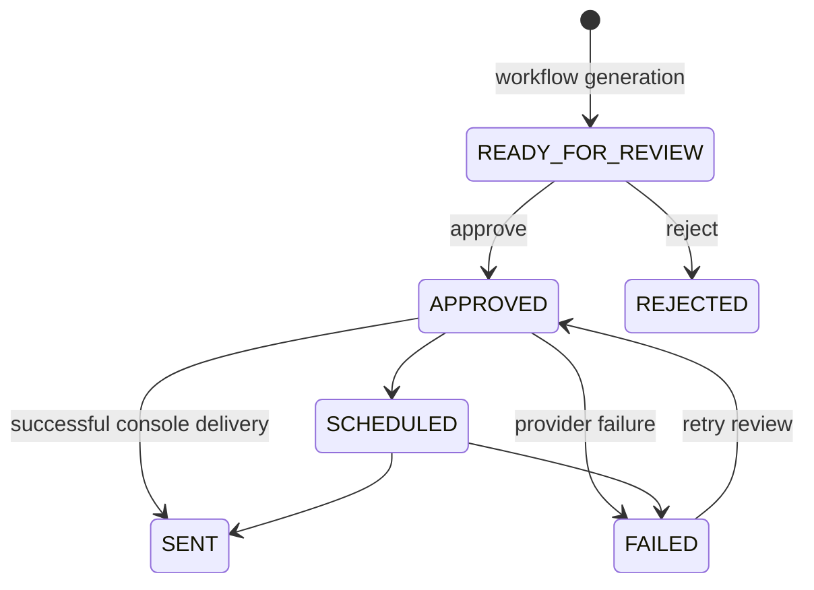

# Newsletter workflow

The offline quick start is:

```console
vortenix db init
vortenix workflow run-daily --demo
vortenix newsletter show NEWSLETTER_ID
vortenix newsletter approve NEWSLETTER_ID
vortenix newsletter send NEWSLETTER_ID
```



Generation always stops at `READY_FOR_REVIEW`. Sending without approval exits unsuccessfully. `--force` allows the current service to resend an already sent newsletter by resetting it to approved immediately before delivery; use it deliberately.

The console provider is a dry-run adapter: it prints subject, recipients, and artifact paths. It does not transmit email.

Personalized newsletters persist their private recipient locally with a `subscriber_id`; delivery uses that subscriber recipient rather than the global `VORTENIX_RECIPIENTS` override. Audience-level newsletters retain the existing environment override behavior. Generated JSON and SQLite data are Git-ignored but should still be protected as private local data.
